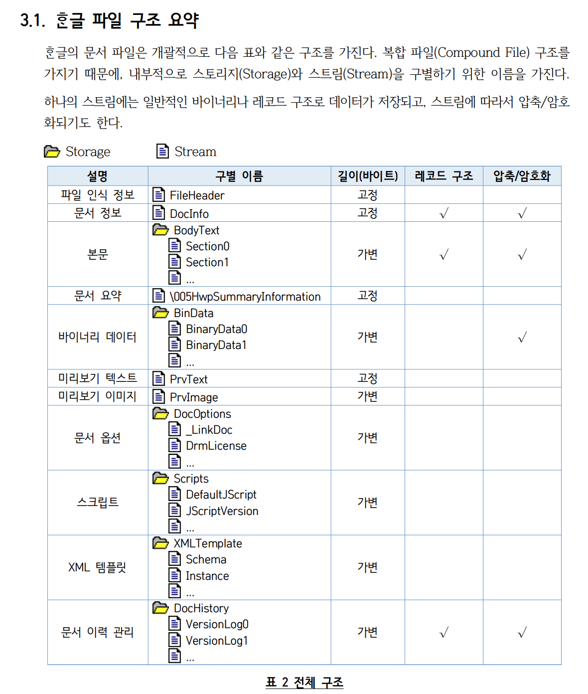
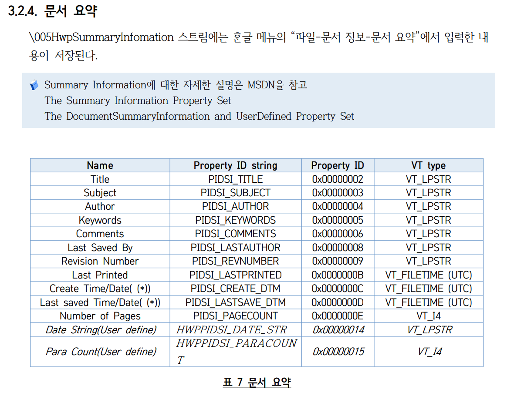
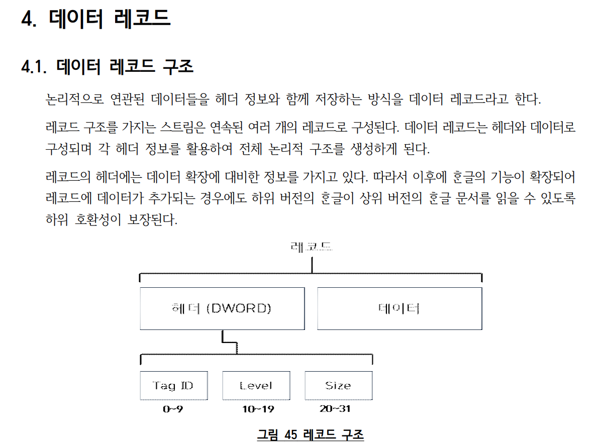
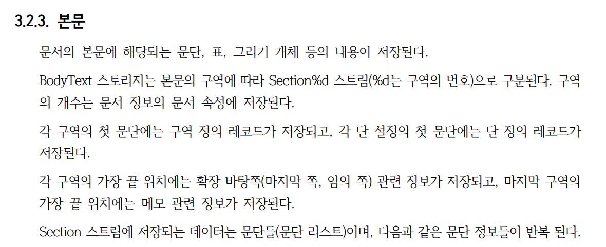

# HWP 형식의 채용공고에서 필요한 정보만 추출해본 건에 대하여

> [관련 내용이 블로그로 이전되었습니다](https://web.d3fau1t.net/blog/1)

아직 국내에선 HWP 포맷의 문서를 사용하는 사례가 적지 않고, 특히 공공기관에서 채용공고를 HWP 포맷으로 제공하는 경우가 많음

채용공고 정보를 추출해서 DB에 적재하는 과정을 자동화하고싶었기 때문에 이 작업을 진행

## 필요한 작업

1. HWP 포맷 문서에서 텍스트를 파싱하기위해 한글문서가 어떤 구조인지 파악
2. 텍스트 파싱 후 LLM에 입력하고 원하는 결과를 얻기위한 프롬프트 작성
3. DB에 적재

## HWP 파일 구조 확인

hwp 포맷 문서에서 텍스트를 파싱하기위해 한글문서가 어떤 구조인지 알아야했고, 작업하면서 내용을 작성함

작성하면서 [한글문서파일형식 5.0 rev1.3.pdf](https://cdn.hancom.com/link/docs/%ED%95%9C%EA%B8%80%EB%AC%B8%EC%84%9C%ED%8C%8C%EC%9D%BC%ED%98%95%EC%8B%9D_5.0_revision1.3.pdf)를 참조했고, 여기서 정리되지 않은 내용이 궁금한경우 해당 문서를 참조하기 바람

### HWP 포맷

- 2000년 10월 이후 출시된 버전에서 사용되는 포맷 모두 HWP5.0 형식을 따름
  - 이후의 버전도 대부분의 골격은 HWP5.0을 따르지만, 추가기능은 HWP5.0과 다를 수 있음
- HWP5.0 는 파일의 크기를 최소화하기위해 압축기능을 사용함
  - 실제 압축되는 부분은 사용자가 입력한 본문과 그림 관련 데이터 부분
  - zlib 을 사용함
- 파일 구조는 윈도우즈 복합 파일 (Compound File Binary File, 이하 [CFBF](https://learn.microsoft.com/ko-kr/cpp/mfc/containers-compound-files?view=msvc-170)) 에 기초를 둠
  - OLE(Object Linking & Embedding) 는 MS의 기술로, 문서 내에서 다른 개체를 포함하거나 링크할 수 있음
  - OLE 문서는 내부적으로 CFBF 를 사용하여 저장됨 -> CFBF 구조를 기반으로 하는 파일 형식 중 하나
  - 문자 코드는 ISO-10646 표준 기반, 대부분은 UTF-16LE 형식으로 전달되고 저장됨.

> `1. 개요` 의 내용을 요약함

### 파일 구조



- HWP는 OLE(Object Linking Embedding) 구조
- 복합 파일 구조를 가지기 때문에, 내부적으로 스토리지(Storage)와 스트림(Stream)을 구별하기 위한 이름을 가짐
- 하나의 스트림에 일반적인 바이너리나 레코드 구조로 데이터가 저장됨
- 일부 스트림은 압축/암호화되기도 함

```python
> hwp_file = olefile.OleFileIO('test.hwp')
> dirs = hwp_file.listdir()
> dirs

[['\x05HwpSummaryInformation'], ['BodyText', 'Section0'], ['BodyText', 'Section1'] ['DocInfo'], ['DocOptions', '_LinkDoc'], ['FileHeader'], ['PrvImage'], ['PrvText'], ['Scripts', 'DefaultJScript'], ['Scripts', 'JScriptVersion']]
```

리스트 안에 여러 개의 리스트가 포함되어있는데, 포함된 각 리스트가 스토리지이고, 스토리지 안에 스트림이 포함되어있다고 이해했음.

### 문서 요약정보 확인



- `\x05HwpSummaryInformation` 스트림에는 문서에 대한 요약정보가 저장됨
  - 문서 제목, 저자, 작성일자, 수정일자 등

이 스트림이 있는지 확인하면 HWP5.0 문서인지 확인할 수 있음

```python
> load_file = olefile.OleFileIO('test.hwp')
> dirs = load_file.listdir()
> is_valid = (
  [self.FILE_HEADER_SECTION] in dirs
  and [self.HWP_SUMMARY_SECTION] in dirs
)

> is_valid
True
```

### 데이터 레코드



> 논리적으로 연관된 데이터들을 헤더 정보와 함께 저장하는 방식을 데이터 레코드라고 함

- 레코드 구조를 가지는 스트림은 연속된 여러 개의 레코드로 구성됨
- 데이터 레코드는 헤더와 데이터로 구성됨
  - 각 헤더 정보를 활용하여 전체 논리적 구조를 생성하게 된다.
- 레코드 헤더의 크기는 4바이트로 고정되어있음
  - TagID: 레코드가 나타내는 데이터 종류를 나타내는 태그
  - Level: 레코드를 논리적으로 매핑하기위한 정보
  - Size: 데이터 영역의 길이를 바이트 단위로 나타냄

레코드의 헤더를 파싱하고 얻어낸 타입과 길이 정보를 활용하여 데이터부분 처리하면됨

```python
def parse_record_header(header_bytes: bytes) -> tuple:
    """
    레코드의 헤더를 파싱합니다.

    4.1 의 데이터 레코드 구조 확인
    """
    # <I: little-endian unsigned int
    # 4바이트 바이너리 데이터를 리틀 엔디안 방식으로 읽어서 32비트 unsigned 정수로 변환합니다.
    header = struct.unpack_from("<I", header_bytes)[0]

    # 하위 10비트만 추출, 0000 0011 1111 1111
    # 레코드 종류를 나타냄, 67인경우 텍스트데이터
    rec_type = header & 0x3FF

    # 상위 12비트만 추출
    # 20비트 오른쪽으로 시프트하고 하위 12비트 0000 1111 1111 1111 남김
    rec_len = (header >> 20) & 0xFFF
    return header, rec_type, rec_len
```

### 본문



`BodyText` 가 포함된 스토리지 안에 `Section{0, 1, 2...}` 스트림이 존재함

- 혹시 압축되어있는 경우 zlib을 사용하여 압축을 해제해야함
- 본문이 필요한 경우 이 스트림 정보를 순서대로 읽되, 헤더의 레코드 길이를 참조하여 읽어야함.
  - 헤더는 4바이트 단위로 읽어야함
  - 본문은 헤더다음의 N바이트를 읽어야함

#### BodyText 스트림 조회

```python
> dirs
[['\x05HwpSummaryInformation'], ['BodyText', 'Section0'], ['BodyText', 'Section1'] ['DocInfo'], ['DocOptions', '_LinkDoc'], ['FileHeader'], ['PrvImage'], ['PrvText'], ['Scripts', 'DefaultJScript'], ['Scripts', 'JScriptVersion']]

> section_numbers = [
  int(d[1][len('Section'):])
  for d in dirs
  if d[0] == 'BodyText'
]

> section_numbers
[0, 1]

> body_sections = [
  f'BodyText/Section{section_number}'
  for section_number in sorted(section_numbers)
]
> body_sections
['BodyText/Section0', 'BodyText/Section1']
```

#### 데이터 파싱

```python
def is_compressed(file: olefile.OleFileIO) -> bool:
    with file.openstream(self.FILE_HEADER_SECTION) as header:
        header_data = header.read()
        return bool(header_data[36] & 1)

with hwp_file.openstream(section) as bodytext:
    logger.info('section: %s', section)
    data = bodytext.read()

unpacked_data = (
    # 15, zlib header
    # 31: gzip header
    # -15: no header, raw deflate
    zlib.decompress(data, -15)
    if is_compressed(load_file)
    else data
)

text = []
i = 0
while i < len(unpacked_data):
    # 4바이트 단위로 헤더 파싱
    _header, rec_type, rec_len = parse_record_header(
        unpacked_data[i : i + 4]
    )
    # 텍스트 레코드인경우 텍스트를 추출
    if rec_type in [67]: # 0x43
        # 레코드 길이만큼 데이터를 읽어옴 (레코드: 헤더 + 데이터)
        # 헤더 다음 영역은 데이터영역인데, 헤더가 가리키는 레코드 길이만큼 읽어와야함
        rec_data = unpacked_data[i + 4 : i + 4 + rec_len]
        text.append(rec_data.decode("utf-16-le"))
    # 다음 인덱스는 헤더 + 데이터 길이만큼 이동
    i += 4 + rec_len

text = "\n".join(text)
```

여기까지 진행하면 HWP 문서에서 텍스트를 추출할 수 있음

텍스트 이외의 레코드 타입도 처리하면 이미지, 표 등의 데이터도 추출할 수 있어보임
